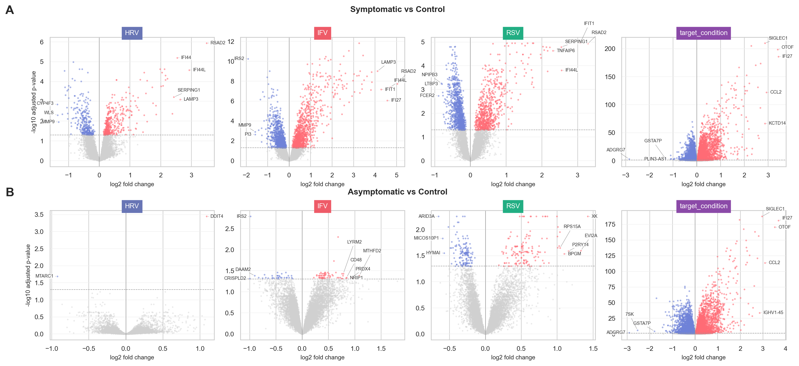
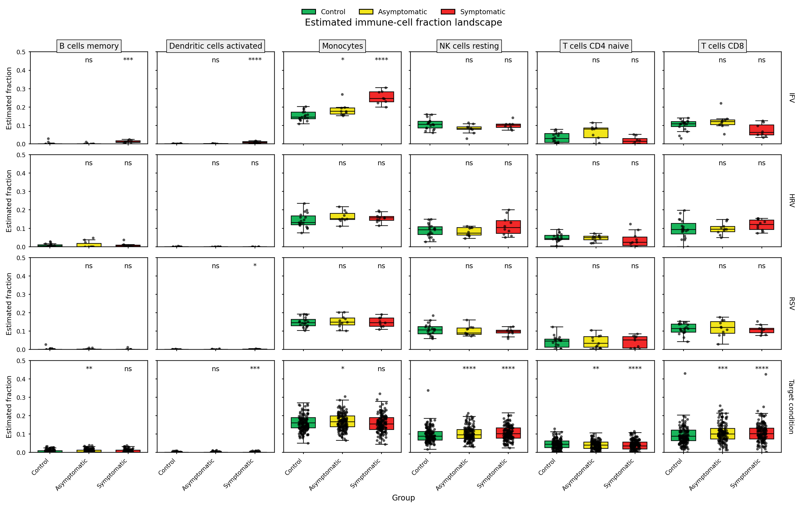
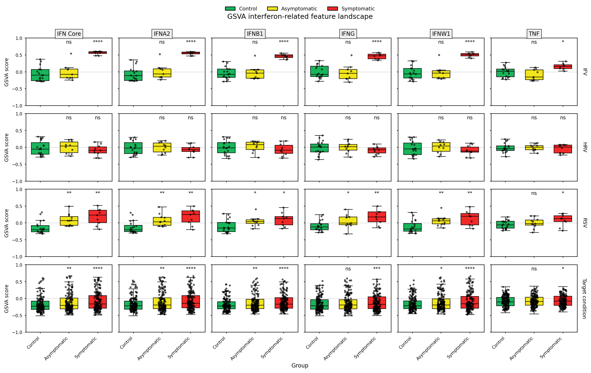
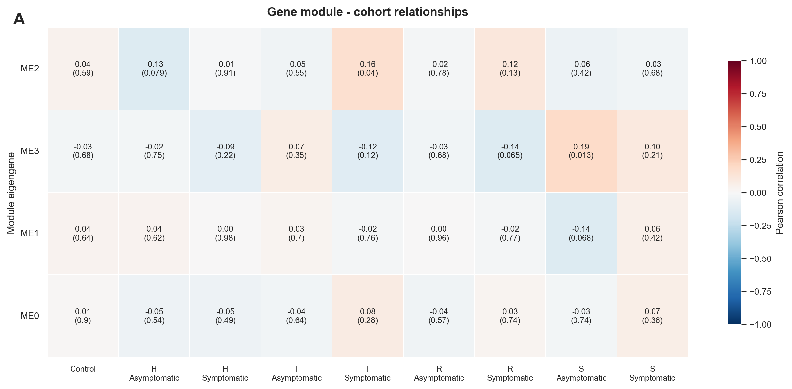
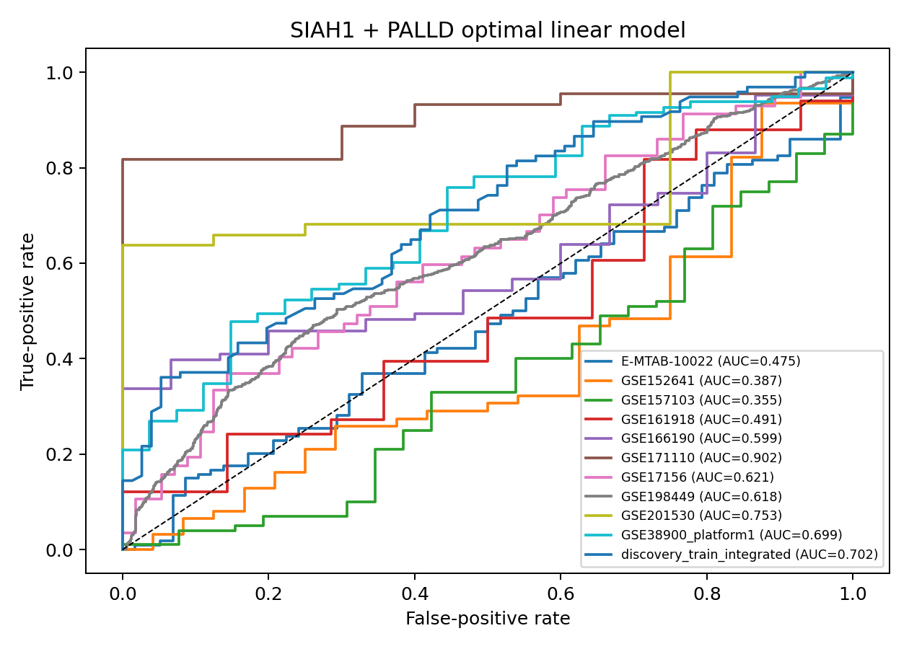
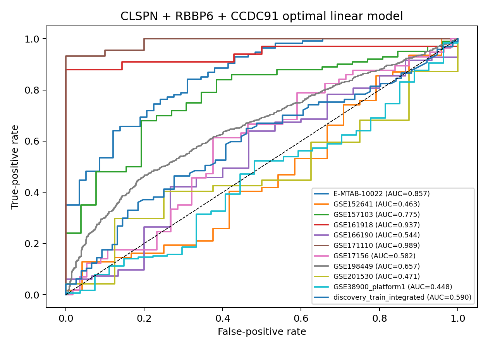

# Signature-of-COVID19
​	Using publicly available transcriptomic datasets, we integrated multiple respiratory virus cohorts and constructed a reproducible pipeline for host-response biomarker discovery, including transcriptomic profiling, immune landscape characterization, network analysis, machine learning feature selection, and cross-cohort validation. 

​	Research Background COVID-19 shares many clinical manifestations with common respiratory viral infections, making early discrimination challenging. Transcriptomic signatures provide a promising strategy for distinguishing SARS-CoV-2 infection from other respiratory viruses and for understanding the underlying immune response mechanisms.

# Research Content

#### Datasets

| Discovery Cohorts |
|---| 
| GSE17156 |
| GSE198449 |

| Discovery Test set |
|---|
| GSE152641 |
| GSE161918 |
| GSE171110 |

| External Validation Cohorts |
|---|
| GSE157103 |
| GSE166190 |
| GSE201530 |
| E-MTAB-10022 |
| GSE38900 |

​	Samples were categorized into Control, Asymptomatic COVID-19 and Symptomatic COVID-19 and compared with common respiratory viral infections including: HRV, IFV, RSV.

#### Analysis Workflow 

1. Data Integration 

   Expression matrices from multiple cohorts were integrated. COCONUT normalization was used to remove batch effects between independent studies. 

2. Differential Expression Analysis 

   Differentially expressed genes were identified between:Symptomatic vs Control and Asymptomatic vs Control for each viral infection. 

3. Functional Activity Analysis 

   GSVA was performed to quantify interferon-related pathway activity.

4. Immune Infiltration Analysis 

   CIBERSORTx was used to estimate immune-cell fractions. 

5. Network Analysis 

   WGCNA was applied to identify disease-associated co-expression modules.

6. Candidate Gene Selection 

   Candidate genes were obtained from DEG analysis and WGCNA modules, and intersected for downstream screening. 

7. Machine Learning

   Five machine-learning models were used:Random Forest, XGBoost, GBM, LASSO, Elastic Net  Robust Rank Aggregation (RRA) was applied to obtain consensus biomarkers. 

8. Signature Construction and Validation
   
   - Alternative signature identified in this project: SIAH1 + PALLD

   Performance was evaluated using ROC analysis across independent cohorts.

# Results

#### 1. Differential Expression Analysis

#### 2. CIBERSORTx and GSVA analysis

#### 3. COCONUT normalization and WGCNA 

#### 4. Signature Validation

